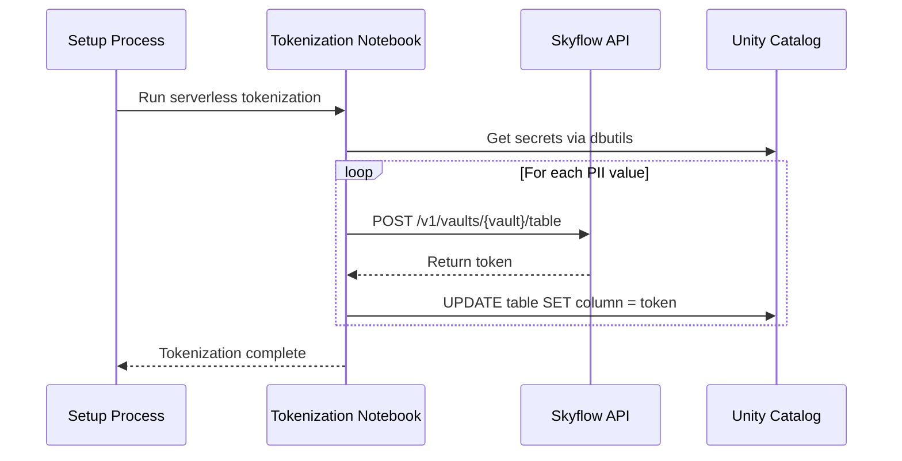
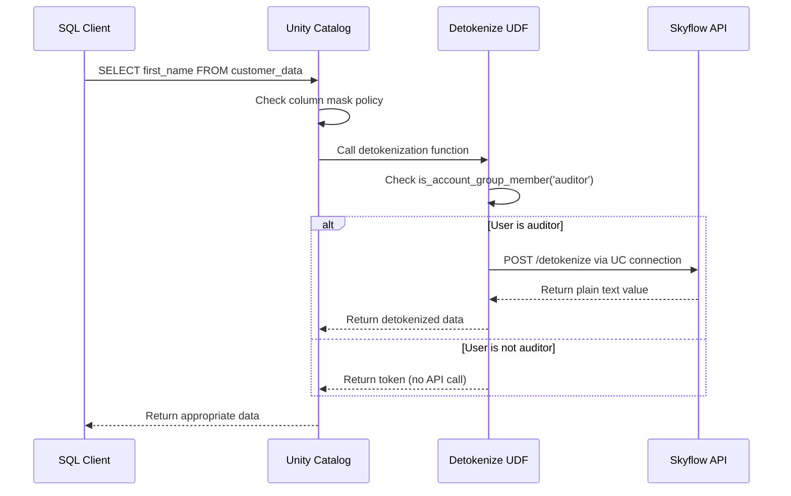

# Skyflow for Databricks: Unity Catalog PII & Sensitive Data Protection

This solution provides secure data tokenization and detokenization capabilities in Databricks Unity Catalog to protect PII and other sensitive data using Skyflow's Data Privacy Vault services. Built with pure SQL UDFs using Unity Catalog HTTP connections for maximum performance and seamless integration with column-level security.

## Table of Contents

- [Quick Start](#quick-start)
- [Key Benefits](#key-benefits)
- [Architecture](#architecture)
- [Flow Diagrams](#flow-diagrams)
  - [Tokenization Flow](#tokenization-flow)
  - [Detokenization Flow](#detokenization-flow)
- [Features](#features)
- [Prerequisites](#prerequisites)
- [Usage Examples](#usage-examples)
- [Project Structure](#project-structure)
- [Configuration](#configuration)
- [Development Guide](#development-guide)
- [Cleanup](#cleanup)
- [Dashboard Integration](#dashboard-integration)
- [Support](#support)
- [License](#license)

## Quick Start

1. **Clone and Configure**:

   ```bash
   git clone <repository>
   cd databricks-skyflow-integration
   cp .env.local.example .env.local
   ```

2. **Set Environment Variables**:

   Edit `.env.local` with your credentials:
   ```bash
   # Databricks Configuration
   DATABRICKS_SERVER_HOSTNAME=your-workspace.cloud.databricks.com
   DATABRICKS_PAT_TOKEN=dapi123...your-pat-token
   DATABRICKS_HTTP_PATH=/sql/1.0/warehouses/your-warehouse-id
   
   # Skyflow Configuration  
   SKYFLOW_VAULT_URL=https://your-vault.vault.skyflowapis.com
   SKYFLOW_PAT_TOKEN=eyJhbGci...your-pat-token
   SKYFLOW_VAULT_ID=your-vault-id
   ```

3. **Deploy Everything**:

   ```bash
   ./setup.sh create demo
   ```

   This creates:
   - ✅ Unity Catalog: `demo_catalog`
   - ✅ Sample table with 25,000 tokenized records
   - ✅ UC connections and secrets
   - ✅ Pure SQL detokenization functions
   - ✅ Column masks (first_name only)
   - ✅ Customer insights dashboard

4. **Test Access**:

   ```sql
   -- Auditor group members see real names
   -- Others see tokens
   SELECT first_name FROM demo_catalog.default.demo_customer_data;
   ```

## Demo

A demonstration of this solution was featured in the 'From PII to GenAI: Architecting for Data Privacy & Security in 2025' webinar.

[](https://www.youtube.com/watch?v=x2-wVW04njw&t=623s)

## Key Benefits

- **🚀 Pure SQL Performance**: Unity Catalog HTTP connections with zero Python overhead
- **🔒 Column-Level Security**: Automatic role-based data masking via Unity Catalog column masks
- **⚡ Serverless Optimized**: Designed for Databricks serverless compute environments
- **🎯 Simplified Architecture**: Single row-by-row processing - no complex batching required
- **🔧 Easy Integration**: Native Unity Catalog functions work with any SQL client (ODBC, JDBC, notebooks)
- **📊 Real-time Access Control**: Instant role-based access via `is_account_group_member()`
- **🛡️ Graceful Error Handling**: Returns tokens on API failures to ensure data availability

## Architecture

The solution leverages Unity Catalog's native capabilities for maximum performance and security:

### Implementation Overview

1. **Unity Catalog HTTP Connections**: Direct API integration with bearer token authentication
2. **Pure SQL UDFs**: Zero Python overhead, native Spark SQL execution
3. **Column Masks**: Automatic role-based data protection at the table level
4. **UC Secrets**: Secure credential storage with `secret()` function references
5. **Account Groups**: Enterprise-grade role management via `is_account_group_member()`

### Key Components

- **Tokenization Connection**: `skyflow_tokenize_conn` → `/v1/vaults/{vault_id}/{table}`
- **Detokenization Connection**: `skyflow_detokenize_conn` → `/v1/vaults/{vault_id}/detokenize`
- **Role-based UDF**: `sam_skyflow_conditional_detokenize()` - only auditors see real data
- **Column Mask UDF**: `sam_skyflow_mask_detokenize()` - applied at table schema level

## Flow Diagrams

### Tokenization Flow



### Detokenization Flow



## Features

### Data Protection

- **Row-by-row processing**: Simple, reliable tokenization/detokenization
- **Column masks**: Automatic application at table schema level
- **Unity Catalog integration**: Native secrets and connections management
- **Role-based access**: Account group membership determines data visibility

### Security

- **Account-level groups**: Enterprise `is_account_group_member()` integration
- **UC-backed secrets**: Secure credential storage via `secret()` function
- **Bearer token authentication**: Automatic token injection via UC connections
- **Column-level security**: Masks applied at metadata level, not query level

### Performance

- **Pure SQL execution**: Zero Python UDF overhead
- **Native Spark SQL**: Full catalyst optimizer integration
- **Serverless optimized**: No cluster management required
- **Connection pooling**: UC manages HTTP connection lifecycle

### Operational

- **Organized SQL structure**: Clean separation of setup/destroy/verify operations
- **Graceful error handling**: API failures return tokens to maintain data access
- **ODBC/JDBC compatible**: Works with any SQL client

## Prerequisites

1. **Databricks Unity Catalog** with:
   - Unity Catalog enabled workspace
   - Account-level groups configured
   - Serverless or cluster-based compute
   - HTTP connections support

2. **Skyflow Account** with:
   - Valid PAT token
   - Configured vault and table schema
   - API access enabled

## Usage Examples

### Basic Detokenization Query

```sql
-- Works with any SQL client (ODBC, JDBC, notebooks, SQL editor)
SELECT 
    customer_id,
    first_name,      -- Detokenized for auditors, token for others
    last_name,       -- Plain text (no column mask)
    email,           -- Plain text (no column mask)
    total_purchases
FROM demo_catalog.default.demo_customer_data
LIMIT 10;
```

### Column Mask Behavior

```sql
-- Same query, different results based on role:

-- Auditor group member sees:
-- customer_id | first_name | last_name | email
-- CUST00001   | Jonathan   | Anderson  | jonathan.anderson@example.com

-- Non-auditor sees:  
-- customer_id | first_name        | last_name | email
-- CUST00001   | 4532-8765-9abc... | Anderson  | jonathan.anderson@example.com
```

### Direct Function Calls

```sql
-- Call detokenization function directly
SELECT demo_skyflow_uc_detokenize('4532-8765-9abc-def0') AS detokenized_value;

-- Conditional detokenization (respects role)
SELECT demo_skyflow_conditional_detokenize('4532-8765-9abc-def0') AS role_based_value;
```

### Role Propagation and Demo Testing

**Important for demos**: After changing user roles or group membership, Databricks may take 1-2 minutes to propagate the changes. If role-based redaction isn't working as expected, check your current group membership:

```sql
-- Check your current user and group membership
SELECT 
    current_user() AS user,
    is_account_group_member('auditor') AS is_auditor,
    is_account_group_member('customer_service') AS is_customer_service,
    is_account_group_member('marketing') AS is_marketing;

-- Alternative check using is_member() for workspace groups
SELECT 
    current_user() AS user,
    is_member('auditor') AS is_auditor,
    is_member('customer_service') AS is_customer_service,
    is_member('marketing') AS is_marketing;
```

If you recently changed roles and the detokenization isn't reflecting the new permissions, wait 1-2 minutes and re-run the query. The functions use both `is_account_group_member()` (for account-level groups) and `is_member()` (for workspace-level groups) to maximize compatibility.

## Project Structure

```text
.
├── README.md                    # This file
├── .env.local.example          # Environment configuration template  
├── config.sh                  # Configuration loader script
├── setup.sh                   # Main deployment script
├── sql/                       # Organized SQL definitions
│   ├── setup/                 # Setup-related SQL files
│   │   ├── create_catalog.sql
│   │   ├── create_sample_table.sql
│   │   ├── create_uc_connections.sql
│   │   ├── setup_uc_connections_api.sql
│   │   └── apply_column_masks.sql
│   ├── destroy/              # Cleanup SQL files
│   │   ├── cleanup_catalog.sql
│   │   ├── drop_functions.sql  
│   │   ├── drop_table.sql
│   │   └── remove_column_masks.sql
│   └── verify/               # Verification SQL files
│       ├── verify_functions.sql
│       ├── verify_table.sql
│       ├── check_functions_exist.sql
│       └── check_table_exists.sql
├── notebooks/                # Serverless tokenization
│   └── notebook_tokenize_table.ipynb
└── dashboards/              # Pre-built analytics
    └── customer_insights_dashboard.lvdash.json
```

## Configuration

### Environment Variables (.env.local)

```bash
# Databricks Connection
DATABRICKS_HOST=https://your-workspace.cloud.databricks.com
DATABRICKS_TOKEN=dapi123...
WAREHOUSE_ID=abc123...

# Skyflow Integration  
SKYFLOW_VAULT_URL=https://vault.skyflow.com
SKYFLOW_VAULT_ID=abc123...
SKYFLOW_PAT_TOKEN=sky123...
SKYFLOW_TABLE=customer_data

# Role Mappings (optional)
PLAIN_TEXT_GROUPS=auditor           # See real data
MASKED_GROUPS=customer_service      # See masked data  
REDACTED_GROUPS=marketing           # See redacted data
```

### Unity Catalog Setup

The solution creates these UC resources:

- **Secrets Scope**: `skyflow-secrets` (UC-backed)
- **HTTP Connections**: `skyflow_tokenize_conn`, `skyflow_detokenize_conn`
- **Catalog**: `{prefix}_catalog` with default schema
- **Functions**: Pure SQL UDFs for tokenization/detokenization
- **Column Masks**: Applied to sensitive columns only

## Development Guide

### Adding New PII Columns

1. **Update tokenization**:

   ```bash
   # Edit setup.sh line ~726
   local pii_columns="first_name,last_name,email"
   ```

2. **Add column masks**:

   ```sql
   -- Edit sql/setup/apply_column_masks.sql
   ALTER TABLE ${PREFIX}_customer_data ALTER COLUMN email SET MASK ${PREFIX}_skyflow_mask_detokenize;
   ```

3. **Redeploy**:

   ```bash
   ./setup.sh recreate demo
   ```

### Testing Changes

```bash
# Test individual SQL components
python3 -c "
import os
from setup import execute_sql
execute_sql('sql/verify/verify_functions.sql')
"

# Full integration test
./setup.sh recreate test
```

### Performance Optimization Ideas

For high-volume scenarios, consider:

- **Bulk processing**: 25-token API batches (requires complex result mapping)
- **Connection pooling**: Multiple UC connections for load distribution
- **Caching layer**: Frequently-accessed token caching with TTL
- **Async processing**: Queue-based bulk operations

## Cleanup

Remove all resources:

```bash
./setup.sh destroy demo
```

This removes:

- Catalog and all objects
- UC connections and secrets
- Functions and column masks
- Notebooks and dashboards

## Dashboard Integration

The included dashboard demonstrates real-time role-based data access:


**Features:**

- **Customer Overview**: Shows first_name detokenization based on user role
- **Analytics**: Purchase patterns, loyalty analysis, consent tracking
- **Real-time**: Updates automatically as data changes
- **Role-aware**: Same dashboard, different data visibility per user

**Access**: Dashboard URL provided after setup completion

## Support

For issues and feature requests:

- **Skyflow Documentation**: [docs.skyflow.com](https://docs.skyflow.com)
- **Databricks Unity Catalog**: [docs.databricks.com/unity-catalog](https://docs.databricks.com/unity-catalog/)
- **GitHub Issues**: Please use the repository issue tracker

## License

This project is provided as sample code for demonstration purposes. Not recommended for production deployment without further review, testing, and hardening.