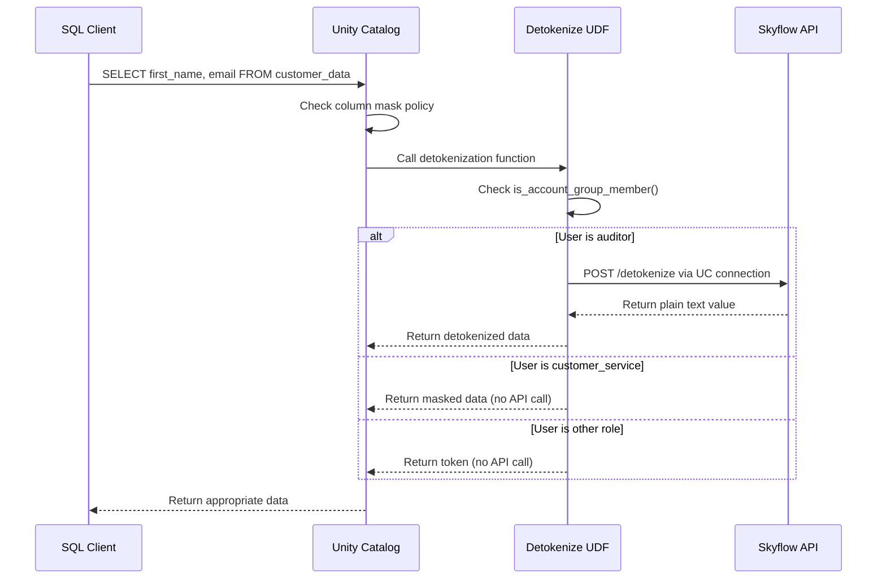

# Skyflow for Databricks: Unity Catalog PII & Sensitive Data Protection

This solution provides secure data tokenization and detokenization capabilities in Databricks Unity Catalog to protect PII and other sensitive data using Skyflow's Data Privacy Vault services. Built with pure SQL UDFs using Unity Catalog HTTP connections for maximum performance and seamless integration with column-level security.

## Table of Contents

- [Quick Start](#quick-start)
- [Architecture](#architecture)
    - [Flow Overview](#flow-overview)
    - [Key Components](#key-components)
- [Configuration](#configuration)
    - [Prerequisites](#prerequisites)
    - [Databricks Permissions Required](#databricks-permissions-required)
    - [Project Structure](#project-structure)
    - [Environment Variables (.env.local)](#environment-variables-envlocal)
- [Development](#development)
    - [Adding New PII Columns](#adding-new-pii-columns)
    - [CLI Features](#cli-features)
    - [Dashboard Integration](#dashboard-integration)
    - [Cleanup](#cleanup)

## Demo

A demonstration of this solution was featured in the 'From PII to GenAI: Architecting for Data Privacy & Security in 2025' webinar.

[](https://www.youtube.com/watch?v=x2-wVW04njw&t=623s)

## Quick Start

1. **Clone and Configure**:
   ```bash
   git clone <repository>
   cd Databricks
   cp .env.local.example .env.local
   ```

2. **Set Environment Variables** - Edit `.env.local` with your credentials:
   ```bash
   # Databricks Configuration
   DATABRICKS_SERVER_HOSTNAME=your-workspace.cloud.databricks.com
   DATABRICKS_PAT_TOKEN=dapi123...your-pat-token
   DATABRICKS_HTTP_PATH=/sql/1.0/warehouses/your-warehouse-id
   
   # Skyflow Configuration  
   SKYFLOW_VAULT_URL=https://your-vault-url
   SKYFLOW_PAT_TOKEN=eyJhbGci...your-pat-token
   SKYFLOW_VAULT_ID=your-vault-id
   ```

3. **Install Dependencies & Deploy**:
   ```bash
   pip install -r requirements.txt
   python setup.py create demo
   ```

   This creates:
   - ✅ Unity Catalog: `demo_catalog` 
   - ✅ Sample table with tokenized records
   - ✅ UC connections and secrets
   - ✅ Pure SQL detokenization functions
   - ✅ Column masks on 6 PII columns with role-based access
   - ✅ Customer insights dashboard

4. **Test Role-Based Access**:
   ```sql
   -- Query returns different results based on your role
   SELECT first_name, last_name, email, phone_number FROM demo_catalog.default.demo_customer_data LIMIT 3;
   
   -- Check your group membership
   SELECT 
       current_user() AS user,
       is_account_group_member('auditor') AS is_auditor,
       is_account_group_member('customer_service') AS is_customer_service,
       is_account_group_member('marketing') AS is_marketing;
   ```

## Key Benefits

- **🚀 Pure SQL Performance**: Unity Catalog HTTP connections with zero Python overhead
- **🔒 Role-Based Security**: Automatic data masking via Unity Catalog column masks
- **⚡ Serverless Ready**: Designed for Databricks serverless compute environments
- **🔧 Easy Integration**: Native Unity Catalog functions work with any SQL client
- **📊 Real-time Access Control**: Instant role-based access via `is_account_group_member()`
- **🛡️ Graceful Error Handling**: Returns tokens on API failures to ensure data availability

## Role-Based Data Access

The solution supports three role-based access levels:

| Role | Group | Data Visibility | Example Output |
|------|-------|----------------|----------------|
| **Auditor** | `auditor` | **Plain text** (detokenized) | `Jonathan` |
| **Customer Service** | `customer_service` | **Masked** (partial hiding) | `J****an` |
| **Marketing** | `marketing` | **Token** (no access) | `4532-8765-9abc-def0` |

### Column Mask Behavior

```sql
-- Same query, different results based on role:
SELECT customer_id, first_name, email FROM demo_catalog.default.demo_customer_data LIMIT 1;

-- Auditor sees:        CUST00001 | Jonathan | jonathan.anderson@example.com
-- Customer Service:    CUST00001 | J****an  | j****an.a*****on@example.com
-- Marketing:           CUST00001 | 4532-8765... | 9876-5432-abcd...
```

**Role Propagation**: After changing user roles, Databricks may take 1-2 minutes to propagate changes.

## Architecture

### Flow Overview



### Key Components

- **Unity Catalog Connection**: `skyflow_conn` → `/v1/vaults/{vault_id}` (unified endpoint)
- **Role-based UDF**: `{prefix}_skyflow_conditional_detokenize()` - handles all role logic
- **Column Mask UDF**: `{prefix}_skyflow_mask_detokenize()` - applied at table schema level

## Python CLI Usage

```bash
# Create integration
python setup.py create demo

# Verify integration  
python setup.py verify demo

# Destroy integration
python setup.py destroy demo

# Get help
python setup.py --help
```

## Configuration

### Prerequisites

1. **Databricks Unity Catalog** with account-level groups configured
2. **Skyflow Account** with valid PAT token and configured vault

### Databricks Permissions Required

The user running this solution needs the following Databricks permissions:

#### Account-Level Permissions
- **Account Admin** OR **Metastore Admin** (to create catalogs and manage Unity Catalog resources)

#### Workspace-Level Permissions
| Permission | Purpose | Required For |
|------------|---------|--------------|
| **Create Cluster/SQL Warehouse** | Job execution | Tokenization notebook runs |
| **Manage Secrets** | Secret scope management | Creating `skyflow-secrets` scope |
| **Workspace Admin** | Resource management | Creating notebooks, dashboards |

#### Unity Catalog Permissions
| Resource | Permission | Purpose |
|----------|------------|---------|
| **Metastore** | `CREATE CATALOG` | Creating `{prefix}_catalog` |
| **Catalog** | `USE CATALOG`, `CREATE SCHEMA` | Schema and table creation |
| **Schema** | `USE SCHEMA`, `CREATE TABLE`, `CREATE FUNCTION` | Table and UDF creation |
| **External Locations** | `CREATE CONNECTION` | HTTP connections for Skyflow API |

#### Required Account Groups
The solution references these account-level groups (create before deployment):
- `auditor` - Users who see detokenized (plain text) data
- `customer_service` - Users who see masked data (e.g., `J****an`)
- `marketing` - Users who see only tokens

#### PAT Token Permissions
Your Databricks PAT token must have:
- **Workspace access** (read/write)
- **Unity Catalog access** (manage catalogs, schemas, functions)
- **SQL Warehouse access** (execute statements)
- **Secrets management** (create/manage secret scopes)

#### Minimum Setup Command
```bash
# Grant necessary permissions (run as Account Admin)
databricks account groups create --display-name "auditor" 
databricks account groups create --display-name "customer_service"
databricks account groups create --display-name "marketing"

# Add users to appropriate groups
databricks account groups add-member --group-name "auditor" --user-name "user@company.com"
```

#### Permission Validation
Test your permissions before deployment:
```bash
# Test configuration and permissions
python setup.py config-test

# This validates:
# - PAT token authentication
# - Unity Catalog access
# - SQL Warehouse connectivity
# - Required file permissions
```

#### Common Permission Issues
| Error | Cause | Solution |
|-------|--------|----------|
| `PERMISSION_DENIED: User does not have CREATE CATALOG` | Missing metastore admin rights | Grant `Metastore Admin` or `Account Admin` |
| `INVALID_STATE: Cannot create secret scope` | Missing secrets permissions | Grant `Manage` permission on workspace secrets |
| `PERMISSION_DENIED: CREATE CONNECTION` | Missing connection permissions | Ensure Unity Catalog `CREATE CONNECTION` permission |
| `Group 'auditor' not found` | Missing account groups | Create account-level groups first |

### Project Structure

```text
skyflow_databricks/          # Main Python package
├── cli/                     # CLI commands
├── config/                  # Configuration management  
├── databricks_ops/          # Databricks SDK operations
├── utils/                   # Utility functions
└── templates/               # Deployment templates
    ├── sql/                 # SQL definitions (setup/destroy/verify)
    ├── notebooks/           # Serverless tokenization notebook
    └── dashboards/          # Pre-built analytics dashboard
```

### Environment Variables (.env.local)

```bash
# Databricks Connection
DATABRICKS_SERVER_HOSTNAME=your-workspace.cloud.databricks.com
DATABRICKS_PAT_TOKEN=dapi123...
DATABRICKS_HTTP_PATH=/sql/1.0/warehouses/your-warehouse-id

# Skyflow Integration  
SKYFLOW_VAULT_URL=https://your-vault.vault.skyflowapis.com
SKYFLOW_VAULT_ID=your-vault-id
SKYFLOW_PAT_TOKEN=eyJhbGci...your-pat-token
SKYFLOW_TABLE=pii
SKYFLOW_TABLE_COLUMN=pii_values
SKYFLOW_BATCH_SIZE=25

# Role Mappings (used by functions)
PLAIN_TEXT_GROUPS=auditor           # See real data
MASKED_GROUPS=customer_service      # See masked data (e.g., J****an)  
REDACTED_GROUPS=marketing           # See tokens only
```

#### Unity Catalog Setup

The solution creates these UC resources:

- **Secrets Scope**: `skyflow-secrets` (UC-backed)
- **HTTP Connection**: `skyflow_conn` (unified connection)
- **Catalog**: `{prefix}_catalog` with default schema
- **Functions**: Pure SQL UDFs for tokenization/detokenization
- **Column Masks**: Applied to sensitive columns only

## Development

### Adding New PII Columns

1. **Update tokenization**: Edit `skyflow_databricks/databricks_ops/notebooks.py` to include new columns in `pii_columns`
2. **Add column masks**: Edit `skyflow_databricks/templates/sql/setup/apply_column_masks.sql`
3. **Redeploy**: `python setup.py recreate demo`

#### CLI Features

- **Databricks SDK Integration**: Uses official SDK methods instead of raw API calls
- **Better Error Handling**: Detailed error messages and automatic retry logic
- **Progress Indicators**: Visual progress bars for long-running operations
- **Rich Output**: Colored, formatted output for better readability

### Dashboard Integration

The included dashboard demonstrates real-time role-based data access with customer insights, purchase patterns, and consent tracking. The dashboard URL is provided after setup completion.

### Cleanup

```bash
python setup.py destroy demo
```

Removes all UC resources: catalog, connections, secrets, functions, column masks, notebooks, and dashboards.

## Support

- **Skyflow Documentation**: [docs.skyflow.com](https://docs.skyflow.com)
- **Databricks Unity Catalog**: [docs.databricks.com/unity-catalog](https://docs.databricks.com/unity-catalog/)
- **GitHub Issues**: Please use the repository issue tracker

## License

This project is provided as sample code for demonstration purposes. Not recommended for production deployment without further review, testing, and hardening.
