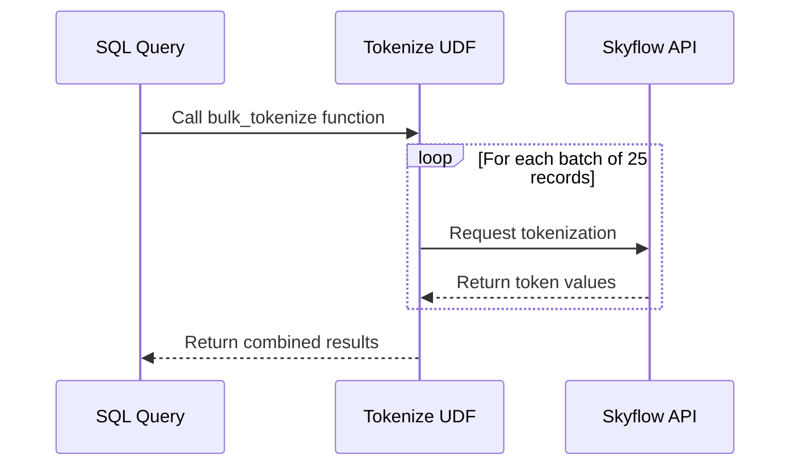
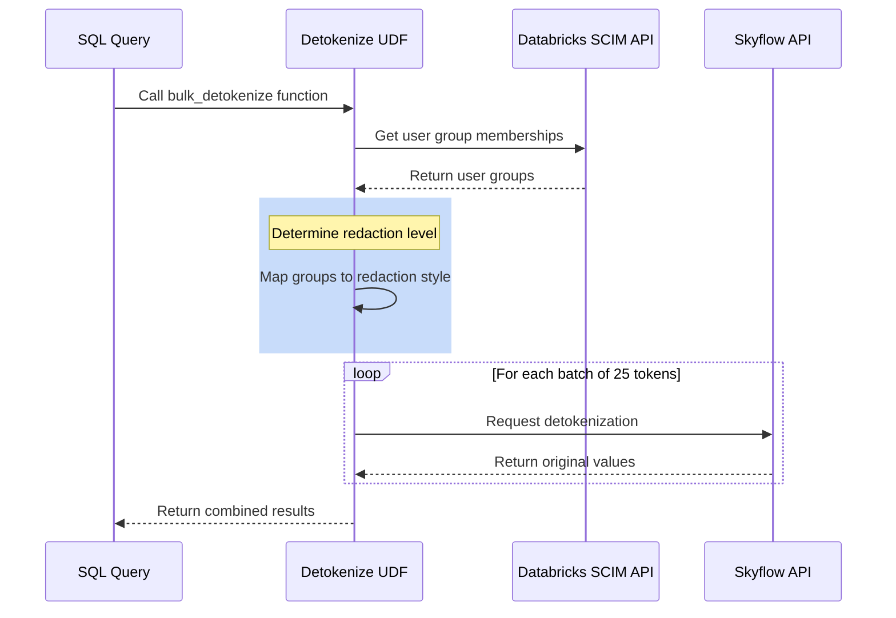

# Skyflow for Databricks: PII & Sensitive Data Protection

This solution provides secure data tokenization and detokenization capabilities in Databricks to protect PII and other sensitive data using Skyflow's Data Privacy Vault services. By implementing user-defined functions (UDFs) that integrate with Skyflow's API, organizations can efficiently protect sensitive data through tokenization and retrieve original PII data while maintaining security through role-based access control.

## Table of Contents
- [Key Benefits](#key-benefits)
- [Architecture](#architecture)
- [Flow Diagrams](#flow-diagrams)
  - [Tokenization Flow](#tokenization-flow)
  - [Detokenization Flow](#detokenization-flow)
- [Features](#features)
- [Prerequisites](#prerequisites)
- [Setup Instructions](#setup-instructions)
- [Usage Examples](#usage-examples)
- [Project Structure](#project-structure)
- [Error Handling](#error-handling)
- [Development Guide](#development-guide)
- [Cleanup](#cleanup)
- [Dashboard Integration](#dashboard-integration)
- [Support](#support)
- [License](#license)

## Demo

This demo was featured in the 'From PII to GenAI: Architecting for Data Privacy & Security in 2025' webinar.

[](https://www.youtube.com/watch?v=x2-wVW04njw&t=623s)

## Key Benefits

- **Comprehensive Data Protection**: Both tokenization and detokenization capabilities
- **Efficient Processing**: Bulk operations with multi-threaded processing
- **Role-Based Access**: Automatic redaction based on user group membership
- **High Performance**: Processes data in configurable chunks of 25 records
- **Seamless Integration**: Native Databricks UDFs for easy implementation
- **Secure**: Comprehensive error handling and role-based access control

## Architecture

The solution consists of several components:

1. **Databricks UDFs**: Python-based user-defined functions that:
   - Handle bulk tokenization and detokenization requests
   - Implement role-based access control via Databricks SCIM API
   - Manage concurrent processing with ThreadPoolExecutor
   - Interface with Skyflow's API
   - Support multiple redaction levels for detokenization

2. **Integration Points**:
   - Databricks SCIM API for user group management
   - Skyflow API for secure tokenization and detokenization
   - Native SQL interface for querying data

## Flow Diagrams

### Tokenization Flow



### Detokenization Flow



## Features

- **Data Protection**: 
  - Tokenization of sensitive data
  - Detokenization with role-based access
  - Multi-threaded batch processing
  - Configurable batch sizes (default: 25 records)
  - Concurrent request handling
  - Automatic batch management

- **Security**:
  - Role-based access control (RBAC) via Databricks groups
  - Multiple redaction levels for detokenization:
    - PLAIN_TEXT: Full data access
    - MASKED: Partially redacted data
    - REDACTED: Fully redacted data
  - Automatic user group mapping
  - Default to most restrictive access

- **Flexibility**:
  - Support for multiple PII columns
  - Custom redaction mapping
  - Real-time processing
  - Bulk operations for both tokenization and detokenization

## Prerequisites

1. **Databricks Environment** with:
   - Python-wrapped SQL function execution capability
   - SCIM API access token
   - Configured user groups

2. **Skyflow Account** with:
   - Valid API credentials
   - Configured vault and schema
   - API access enabled

## Setup Instructions

1. **Quick Setup**:
   ```bash
   ./setup.sh create <prefix>
   ```
   This automatically:
   - Creates the tokenization and detokenization functions
   - Sets up a sample customer table
   - Deploys example notebooks
   - Installs a customer insights dashboard

2. **Manual Setup**:
   - Copy and configure settings:
     ```bash
     cp config.sh.example config.sh
     ```
   - Edit config.sh with your:
     - Databricks credentials
     - Skyflow vault details
     - Group mappings

## Usage Examples

### Tokenization
```sql
USE hive_metastore.default;

WITH grouped_data AS (
    SELECT
        1 AS group_id,
        COLLECT_LIST(first_name) AS first_names,
        COLLECT_LIST(last_name) AS last_names,
        COLLECT_LIST(email) AS emails
    FROM raw_customer_data
    GROUP BY group_id
)
SELECT
    skyflow_bulk_tokenize(first_names) AS tokenized_first_names,
    skyflow_bulk_tokenize(last_names) AS tokenized_last_names,
    skyflow_bulk_tokenize(emails) AS tokenized_emails
FROM grouped_data;
```

### Detokenization
```sql
USE hive_metastore.default;

WITH grouped_data AS (
    SELECT
        1 AS group_id,
        COLLECT_LIST(first_name) AS first_names,
        COLLECT_LIST(last_name) AS last_names,
        COLLECT_LIST(email) AS emails
    FROM customer_data
    GROUP BY group_id
),
detokenized_batches AS (
    SELECT
        skyflow_bulk_detokenize(first_names, current_user()) AS detokenized_first_names,
        skyflow_bulk_detokenize(last_names, current_user()) AS detokenized_last_names,
        skyflow_bulk_detokenize(emails, current_user()) AS detokenized_emails
    FROM grouped_data
)
SELECT * FROM detokenized_batches;
```

## Project Structure

```
.
├── config.sh              # Configuration settings
├── setup.sh              # Deployment script
├── dashboards/           # Pre-built dashboards
├── notebooks/            # Example notebooks
│   ├── notebook_tokenize_table.ipynb        # Tokenization examples
│   └── notebook_call_tokenize_table.ipynb   # Tokenization usage
├── python/              # Python source code
└── sql/                 # SQL definitions
```

## Error Handling

The UDFs implement comprehensive error handling:

- **Input Validation**:
  - Data format verification
  - Token format verification
  - User authentication checks
  - Group membership validation
  
- **Service Errors**:
  - API failures
  - Network timeouts
  - Authentication issues

- **Recovery Mechanisms**:
  - Default to most restrictive access
  - Batch failure isolation
  - Detailed error reporting

## Development Guide

1. **Local Testing**:
   ```python
   # Test the UDFs locally
   python python/test_tokenize.py
   python python/test_detokenize.py
   ```

2. **Deployment**:
   ```bash
   # Deploy changes
   ./setup.sh recreate <prefix>
   ```

## Cleanup

Remove all created resources:
```bash
./setup.sh destroy <prefix>
```

## Dashboard Integration

The repository includes a pre-built customer insights dashboard that demonstrates the detokenization function in action:


Features:
- Customer overview with detokenized PII
- Spending analysis
- Language preferences
- Consent metrics
- Acquisition trends

Access at:
```
https://<your-databricks-host>/sql/dashboards/v3/<dashboard-id>
```

## Support

For issues and feature requests, please contact your Skyflow representative or visit docs.skyflow.com.

## License

This project is provided as sample code for demonstration purposes. Not recommended for production deployment without further review, testing, and hardening.
