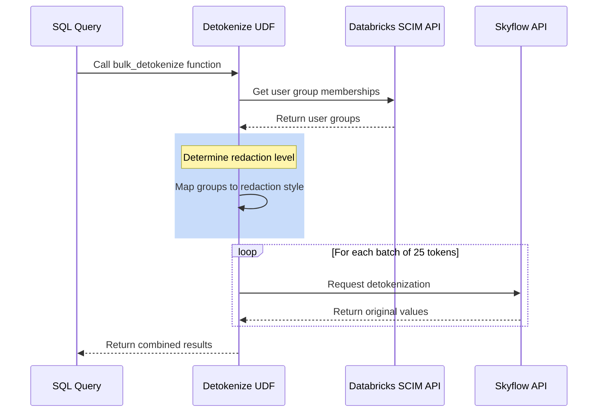

# Skyflow for Databricks: Bulk Detokenization UDF

This solution provides a secure way to detokenize sensitive data in Databricks tables using Skyflow's detokenization service. By implementing a user-defined function (UDF) that integrates with Skyflow's API, organizations can efficiently retrieve original PII data while maintaining security through role-based access control.

## Table of Contents
- [Key Benefits](#key-benefits)
- [Architecture](#architecture)
- [Flow Diagrams](#flow-diagrams)
  - [Detokenization Flow](#detokenization-flow)
- [Features](#features)
- [Prerequisites](#prerequisites)
- [Setup Instructions](#setup-instructions)
- [Usage Examples](#usage-examples)
- [Project Structure](#project-structure)
- [Error Handling](#error-handling)
- [Development Guide](#development-guide)
- [Cleanup](#cleanup)
- [Dashboard Integration](#dashboard-integration)
- [Support](#support)
- [License](#license)

## Key Benefits

- **Efficient Processing**: Bulk detokenization with multi-threaded processing
- **Role-Based Access**: Automatic redaction based on user group membership
- **High Performance**: Processes data in configurable chunks of 25 tokens
- **Seamless Integration**: Native Databricks UDF for easy implementation
- **Secure**: Comprehensive error handling and role-based access control

## Architecture

The solution consists of several components:

1. **Databricks UDF**: A Python-based user-defined function that:
   - Handles bulk detokenization requests
   - Implements role-based access control via Databricks SCIM API
   - Manages concurrent processing with ThreadPoolExecutor
   - Interfaces with Skyflow's API
   - Supports multiple redaction levels

2. **Integration Points**:
   - Databricks SCIM API for user group management
   - Skyflow API for secure detokenization
   - Native SQL interface for querying data

## Flow Diagrams

### Detokenization Flow


```mermaid
sequenceDiagram
    participant SQL as SQL Query
    participant UDF as Detokenize UDF
    participant SCIM as Databricks SCIM API
    participant SF as Skyflow API

    SQL->>UDF: Call bulk_detokenize function
    UDF->>SCIM: Get user group memberships
    SCIM-->>UDF: Return user groups
    
    rect rgb(200, 220, 250)
        Note over UDF: Determine redaction level
        UDF->>UDF: Map groups to redaction style
    end
    
    loop For each batch of 25 tokens
        UDF->>SF: Request detokenization
        SF-->>UDF: Return original values
    end
    
    UDF-->>SQL: Return combined results
```

## Features

- **Efficient Processing**: 
  - Multi-threaded batch processing
  - Configurable batch sizes (default: 25 tokens)
  - Concurrent request handling
  - Automatic batch management

- **Security**:
  - Role-based access control (RBAC) via Databricks groups
  - Multiple redaction levels:
    - PLAIN_TEXT: Full data access
    - MASKED: Partially redacted data
    - REDACTED: Fully redacted data
  - Automatic user group mapping
  - Default to most restrictive access

- **Flexibility**:
  - Support for multiple PII columns
  - Custom redaction mapping
  - Real-time processing

## Prerequisites

1. **Databricks Environment** with:
   - Python-wrapped SQL function execution capability
   - SCIM API access token
   - Configured user groups

2. **Skyflow Account** with:
   - Valid API credentials
   - Configured vault and schema
   - API access enabled

## Setup Instructions

1. **Quick Setup**:
   ```bash
   ./setup.sh create <prefix>
   ```
   This automatically:
   - Creates the detokenization function
   - Sets up a sample customer table
   - Deploys example notebooks
   - Installs a customer insights dashboard

2. **Manual Setup**:
   - Copy and configure settings:
     ```bash
     cp config.sh.example config.sh
     ```
   - Edit config.sh with your:
     - Databricks credentials
     - Skyflow vault details
     - Group mappings

## Usage Examples

```sql
USE hive_metastore.default;

WITH grouped_data AS (
    SELECT
        1 AS group_id,
        COLLECT_LIST(first_name) AS first_names,
        COLLECT_LIST(last_name) AS last_names,
        COLLECT_LIST(email) AS emails
    FROM customer_data
    GROUP BY group_id
),
detokenized_batches AS (
    SELECT
        skyflow_bulk_detokenize(first_names, current_user()) AS detokenized_first_names,
        skyflow_bulk_detokenize(last_names, current_user()) AS detokenized_last_names,
        skyflow_bulk_detokenize(emails, current_user()) AS detokenized_emails
    FROM grouped_data
)
SELECT * FROM detokenized_batches;
```

## Project Structure

```
.
├── config.sh              # Configuration settings
├── setup.sh              # Deployment script
├── dashboards/           # Pre-built dashboards
├── notebooks/            # Example notebooks
├── python/              # Python source code
└── sql/                 # SQL definitions
```

## Error Handling

The UDF implements comprehensive error handling:

- **Input Validation**:
  - Token format verification
  - User authentication checks
  - Group membership validation
  
- **Service Errors**:
  - API failures
  - Network timeouts
  - Authentication issues

- **Recovery Mechanisms**:
  - Default to most restrictive access
  - Batch failure isolation
  - Detailed error reporting

## Development Guide

1. **Local Testing**:
   ```python
   # Test the UDF locally
   python python/test_detokenize.py
   ```

2. **Deployment**:
   ```bash
   # Deploy changes
   ./setup.sh recreate <prefix>
   ```

## Cleanup

Remove all created resources:
```bash
./setup.sh destroy <prefix>
```

## Dashboard Integration

The repository includes a pre-built customer insights dashboard that demonstrates the detokenization function in action:


Features:
- Customer overview with detokenized PII
- Spending analysis
- Language preferences
- Consent metrics
- Acquisition trends

Access at:
```
https://<your-databricks-host>/sql/dashboards/v3/<dashboard-id>
```

## Support

For issues and feature requests, please contact your Skyflow representative or visit docs.skyflow.com.

## License

This project is provided as sample code for demonstration purposes. Not recommended for production deployment without further review, testing, and hardening.
